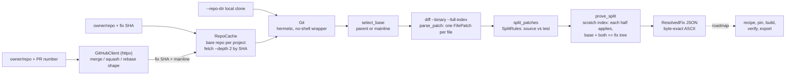

# RepoRewind

[](https://github.com/vipul21435/reporewind/actions/workflows/ci.yml)


Rebuild an open-source Python repository at any historical commit inside a
digest-pinned Docker image, then prove that a fix commit flips its tests from
failing to passing.

> **Status.** The first pipeline stage, **resolve**, is complete: a fix
> commit or a merged GitHub pull request becomes a base commit plus a source
> patch and a test patch, with a proof that the split is exact. It ships
> with a hermetic git layer, an offline demo and a digest-pinned CLI image.
> Recipe detection, historical pinning, environment builds, automated
> fail-to-pass verification and bundle export are **not built yet**; they
> are listed under [Roadmap](#roadmap) and tracked in [PLAN.md](PLAN.md).

## Why this exists

Benchmarks for AI coding agents are only as trustworthy as their
environments. A task built from a real bug fix is useful only if the
repository builds exactly as it did on the day of the fix, the tests the fix
touches fail on the parent commit and pass after the fix, and anyone can
rebuild and re-verify the result from pinned inputs.

RepoRewind automates that loop. It grew out of the author's work building
benchmark tasks for AI coding agents (historical-commit environments,
verifier images, per-repository build recipes, build locks and caches) and
is written from scratch as an open, generic tool. No client tasks or data
are included.

## What works today

- **Resolve a fix commit** (`reporewind resolve OWNER/REPO SHA`): pick the
  base (the only parent, or an explicit `--mainline` for a merge commit;
  root commits are rejected) and split the diff per file into a **source
  patch** (the fix an agent would have to write) and a **test patch** (what
  proves it).
- **Resolve a merged GitHub pull request** (`--pr N`): the REST API maps a
  merge commit to mainline 1 and a squash merge to its single commit; a
  multi-commit rebase merge is rejected instead of silently resolving only
  its last commit. `GITHUB_TOKEN` is optional.
- **Proof that the split is exact**: in a scratch index, the source patch
  and the test patch each apply cleanly to the base, and base + both
  reproduces the fix commit's **tree id**. A fix with no test changes, no
  source changes or an empty diff is rejected (exit code 10), because it
  cannot prove a flip.
- **Every diff shape**: adds, deletes, renames, mode changes, empty files,
  binary files, quoted non-ASCII paths and file-to-symlink type changes.
  Split rules are configurable (`--test-dir`, `--test-file`, `--include`,
  `--exclude`).
- **Byte-exact JSON**: diffs of non-UTF-8 files keep their raw bytes as
  `\udcXX` escapes in ASCII JSON, and `load_resolved_fix` restores them so
  the patch re-applies byte for byte.
- **Minimal fetching**: commits are fetched by SHA with `--depth 2` into one
  bare cache repository per project, so a repeat run needs no network for
  the git side.
- **Hermetic git layer**: no shell, no user or system git config, option-like
  revisions rejected before git runs; a diff made on a laptop and one made in
  CI are byte-identical.
- **Offline demo and CLI image**: `make demo` runs the whole resolve story on
  a bundled sample repository in a few seconds; `make docker-demo` runs the
  same demo inside a non-root image built on a digest-pinned base.

## Quickstart

Requirements: [uv](https://docs.astral.sh/uv/) (it installs Python 3.12 for
you) and git. Docker is only needed for step 3; step 4 needs network access.

```bash
git clone https://github.com/vipul21435/reporewind && cd reporewind
make demo                  # offline demo on the bundled sample repo (about 3 s)
make docker-demo           # same demo inside the digest-pinned CLI image
uv run reporewind resolve pallets/markupsafe --pr 477 -o markupsafe-477.json
```

These four commands were run in a fresh clone on 2026-09-29; the outputs
below are copied from those runs.

## Usage

### The offline demo

`demo/slugkit.fi` is a `git fast-import` stream of a tiny slug library whose
commit SHAs are pinned (it is generated by `demo/make_sample.py` with a fixed
identity and clock; a test checks the committed stream matches the generator
byte for byte). `demo/run.sh` imports it into a scratch repository and runs:

```console
$ make demo
== 1/5 import the bundled sample repository (pinned SHAs, no network)
* 61a502b (HEAD -> main, tag: refactor-only) refactor: name the ASCII folding step
*   1cd73e1 (tag: merge-unicode) Merge pull request #7 from example/unicode-slugs
|\
| * 737a92c (unicode-slugs) fix: transliterate accented letters instead of dropping them
* | 1c2c60f docs: list supported Python versions
|/
* cd84329 (tag: fix-separators) fix: collapse runs of separators in slugify
* 712f042 docs: add usage
* 8015986 chore: initial commit

== 2/5 resolve a plain fix commit
resolved example/slugkit fix cd84329fdd59 (fix: collapse runs of separators in slugify)
  base    712f042982ab (parent 1 of 1)
  source  2 files: CHANGES.md, src/slugkit/core.py
  tests   1 file: tests/test_core.py
  proof   source and test patches each apply cleanly to base; base + both == fix tree decda5454c98
  wrote   /var/folders/.../reporewind-demo.LHuD8J/fix-separators.json

== 3/5 resolve a merged pull request (merge commit, mainline 1)
resolved example/slugkit fix 1cd73e1f716d (Merge pull request #7 from example/unicode-slugs)
  base    1c2c60f7c97c (parent 1 of 2)
  source  1 file: src/slugkit/core.py
  tests   1 file: tests/test_unicode.py
  proof   source and test patches each apply cleanly to base; base + both == fix tree 4cbd9fb69737
  wrote   /var/folders/.../reporewind-demo.LHuD8J/merge-unicode.json

== 4/5 a commit without test changes cannot prove a flip and is rejected
error: fix 61a502bf56cf changes no test files, so it cannot prove a fail-to-pass flip; if its tests live elsewhere, adjust the split rules (test dirs, include globs)
exit code 10 (resolve error), as expected

== 5/5 check the fail-to-pass flip of fix-separators by hand
base + test.patch:             FAILED (failures=1)
base + fix.patch + test.patch: OK

demo finished in 3s
```

Step 5 is done **by the demo script** with `git apply` and `unittest`, using
the patches from the resolved JSON. It shows what the resolve output is for;
automating it (JUnit parsing, FAIL_TO_PASS / PASS_TO_PASS lists, flaky-test
detection) is the planned verify stage. Set `REPOREWIND_DEMO_WORK=DIR` to
keep the JSON and patches. The test patch from step 2, as stored in the JSON:

```diff
diff --git a/tests/test_core.py b/tests/test_core.py
index b0f585fe3cec48296fd0ef23d9636e80e1abd088..b04a1172231bc39fb5b65d045176c69d1685b027 100644
--- a/tests/test_core.py
+++ b/tests/test_core.py
@@ -6,3 +6,6 @@ from slugkit import slugify
 class SlugifyTest(unittest.TestCase):
     def test_lowercases(self):
         self.assertEqual(slugify("Hello"), "hello")
+
+    def test_collapses_runs_of_separators(self):
+        self.assertEqual(slugify("  Hello,  World! "), "hello-world")
```

### Resolving real pull requests

Real output from the two public pull requests the offline test fixtures were
recorded from:

```console
$ reporewind resolve pallets/markupsafe --pr 477 -o markupsafe-477.json
pull request #477 (relax speedups str check) landed as a merge-commit e85aff4d878a
resolved pallets/markupsafe fix e85aff4d878a (relax speedups str check (#477))
  base    9c44ecf45141 (parent 1 of 2)
  source  3 files: CHANGES.rst, pyproject.toml, src/markupsafe/_speedups.c
  tests   1 file: tests/test_escape.py
  proof   source and test patches each apply cleanly to base; base + both == fix tree b6ce5f96a609
  wrote   markupsafe-477.json

$ reporewind resolve python-attrs/attrs --pr 1606 -o attrs-1606.json
pull request #1606 (Stop evolve dunders from being modified) landed as a single-commit f53fc5440d7f
resolved python-attrs/attrs fix f53fc5440d7f (Stop evolve dunders from being modified (#1606))
  base    f38b8a3f1625 (parent 1 of 1)
  source  2 files: changelog.d/1606.change.md, src/attr/_make.py
  tests   1 file: tests/test_functional.py
  proof   source and test patches each apply cleanly to base; base + both == fix tree c078cc64795b
  wrote   attrs-1606.json

$ jq '{pr_number, fix: .fix.sha, base: .base.sha,
       tests: [.test_patches[] | {path, change}]}' attrs-1606.json
{
  "pr_number": 1606,
  "fix": "f53fc5440d7f86aac4328aec7a563eb48634177f",
  "base": "f38b8a3f1625060aa4245930822c34c11c252f83",
  "tests": [
    {
      "path": "tests/test_functional.py",
      "change": "modified"
    }
  ]
}
```

### Command reference

| Command | What it does |
|---|---|
| `reporewind resolve OWNER/REPO FULL_SHA` | Fetch the fix commit into the cache, resolve and print the `ResolvedFix` JSON |
| `reporewind resolve OWNER/REPO --pr N` | Same, starting from a merged GitHub pull request |
| `reporewind resolve OWNER/REPO REV --repo-dir PATH` | Read an existing local clone; accepts short SHAs, branches and tags |
| `-m / --mainline N` | Base for a merge commit (1-based, like `git cherry-pick -m`) |
| `--test-dir`, `--test-file`, `--include`, `--exclude` | Override the split rules (defaults: `tests/`, `test/`, `test_*.py`, `*_test.py`, `tests.py`, `conftest.py`) |
| `-o / --output FILE`, `-q / --quiet` | Write JSON to a file; drop the stderr summary |
| `--cache-dir DIR`, `--source URL` | Cache location (default `$REPOREWIND_HOME`); fetch from a mirror |
| `reporewind version` / `--version` | Print the version |

Exit codes: 0 success, 2 bad input (invalid repo reference, split rule, or a
short SHA without `--repo-dir`), 3 missing tool (git not on `PATH`), 4 failed
git command, 10 resolve error (root commit, merge without a mainline, no test
changes, unmerged PR, GitHub API error).

### Docker

```bash
make docker-build                                   # docker build -t reporewind:local .
docker run --rm reporewind:local --version          # reporewind 0.1.0
docker run --rm reporewind:local resolve pallets/markupsafe --pr 477
```

The image is two-stage: `ghcr.io/astral-sh/uv` and `python:3.12-slim`, both
pinned by `@sha256` digest; the runtime stage adds git, runs as uid 10001,
carries `LABEL project=reporewind` and uses the CLI as its entrypoint.
`make docker-build` prunes the project's dangling images afterwards.

## Architecture



| Module | Responsibility |
|---|---|
| `reporewind.cli` | Typer CLI; maps each error category to a stable exit code |
| `reporewind.resolve.github` | PR number -> landed commit and merge shape (REST API, injectable transport) |
| `reporewind.resolve.cache` | One bare repository per project under `$REPOREWIND_HOME/repos/`, commits pinned by ref |
| `reporewind.resolve.patches` | Parse `git diff` output into per-file `FilePatch` objects |
| `reporewind.resolve.split` | `SplitRules` and the source/test split |
| `reporewind.resolve.resolver` | Base selection and the scratch-index tree-id proof |
| `reporewind.resolve.serialize` | Byte-exact `ResolvedFix` JSON (dump and load) |
| `reporewind.gitops` | No-shell `Git` wrapper: fetch by SHA, diff, apply, scratch-index apply, worktrees |
| `reporewind.models` / `errors` / `proc` | Frozen pydantic v2 models, typed error hierarchy, `CommandRunner` protocol |
| `reporewind.testing` | `RepoFactory`: deterministic throwaway repositories (fixed identity and clock) |

## Measured numbers

All from runs on 2026-09-29 (macOS arm64, Python 3.12); the command that
produced each number is next to it.

| What | Result | Command |
|---|---|---|
| Offline test suite | 300 passed, 2 deselected (e2e) | `make cov` |
| Branch-inclusive coverage | 99.87% (gate: 85%) | `make cov` |
| Network end-to-end tests (live GitHub API and git remotes) | 2 passed | `make e2e` |
| Offline demo, wall clock | 3 s | `make demo` |
| Cache size after resolving attrs#1606 vs a full bare clone | 1.0M vs 6.2M | `du -sh` on `$REPOREWIND_HOME/repos/github.com/*` and on `git clone --bare` |
| Same for markupsafe#477 | 396K vs 1.2M | as above |
| Image layers added on top of `python:3.12-slim` | git 109MB, venv 30MB | `docker history reporewind:local` |
| Source / test code size | 2648 / 2693 lines | `wc -l src/reporewind/*.py src/reporewind/resolve/*.py` and `wc -l tests/*.py` |

CI (GitHub Actions) runs ruff, ruff format, `mypy --strict` and the coverage
suite on every push and pull request, and a second job builds the image and
runs the demo inside it.

## Design decisions

- **Built fresh, not forked.** Existing open-source harnesses in this space
  are large evaluation frameworks; a clean, typed implementation of the
  narrow spec is smaller and easier to review.
- **Prove the split, do not trust it.** Base + source + test must reproduce
  the fix commit's tree id, computed in a temporary `GIT_INDEX_FILE`: no
  checkout, and nothing written to your clone except objects.
- **The test patch never edits library code.** A patch is a test change
  only if every path it touches is a test path, so a rename across the
  test/source boundary lands in the source patch. `testing/` is not a
  default test directory because it is often a package's public helpers.
- **Hermetic git.** `GIT_CONFIG_GLOBAL=/dev/null`, `GIT_CONFIG_NOSYSTEM=1`,
  scrubbed `GIT_DIR`-style variables, `GIT_CEILING_DIRECTORIES`, an allow
  list of transports and `LC_ALL=C`. The trade-off: user `insteadOf`
  rewrites and credential helpers are ignored, so private repositories are
  out of scope.
- **Parents come from the raw commit object.** `%P` reports no parents at a
  shallow-fetch boundary, which made a base look like a root commit and made
  the JSON depend on fetch depth. A test checks that shallow-cache and
  full-clone resolutions produce byte-identical JSON.
- **Offline by default.** Every unit and integration test builds throwaway
  repositories with `repo_factory`; GitHub responses are recorded from the
  live API and replayed. Anything needing the network or Docker is marked
  `e2e` and runs with `make e2e`.
- **Bundled demo data as text.** The sample repository is a `git
  fast-import` stream rather than a binary bundle, so it is reviewable in a
  diff and regenerated deterministically by `make sample`.
- **Stable exit codes per error category**, so scripts and CI can tell bad
  input from a git failure from a commit that cannot prove a flip.

## Roadmap

Planned, **not built yet** (details and acceptance criteria in
[PLAN.md](PLAN.md)):

1. **Build recipes** - a pydantic `Recipe` plus detectors for
   `pyproject.toml` (PEP 621, setuptools, poetry, hatch, flit), `setup.py`
   (parsed with `ast`, never executed), `setup.cfg`, `requirements*.txt` and
   `tox.ini`; YAML recipes with deep-merged human overrides and a stable
   recipe hash.
2. **Historical pinning** - infer the Python version from `requires-python`,
   classifiers and CPython release dates; resolve dependencies as of the
   commit date with `uv pip compile --exclude-newer`; resolve
   `python:X.Y-slim` to a digest with an offline fallback table.
3. **Environment builds** - deterministic Dockerfile per task, images tagged
   by a content hash of recipe + lock + base digest, a JSON build-cache index
   and a cross-process build lock.
4. **Automated verification** - JUnit XML parsing, local and Docker
   executors, the fail-to-pass protocol with FAIL_TO_PASS / PASS_TO_PASS
   lists and a verdict, and flaky-test detection by re-runs.
5. **Task bundles and service** - schema-validated `task.json`, patches,
   test lists, lock and a sha256 manifest; `reporewind run` end to end; a
   small FastAPI service with a job queue.
6. **Compose and public demos** - `docker-compose.yml` for the API, a
   manually triggered CI job for the e2e tests, and committed bundles for
   1-2 real public repositories.
7. **Benchmarks and docs** - throughput and cold vs warm build timings under
   `bench/`, `docs/` pages and a changelog.

## Development

```bash
make install          # uv sync --locked + pre-commit hooks
make lint typecheck   # ruff check + ruff format --check, mypy --strict on src/
make cov              # offline suite with branch coverage (fails under 85%)
make e2e              # network tests (live GitHub API)
make sample           # regenerate demo/slugkit.fi from demo/make_sample.py
```

Python 3.12, `src/` layout, dependencies locked in `uv.lock`. Recorded
GitHub fixtures are refreshed by `tests/fixtures/github/record.sh`.
Configuration via environment (see `.env.example`): `GITHUB_TOKEN`
(optional) and `REPOREWIND_HOME` (cache location, default `.reporewind`).

## License

MIT, see [LICENSE](LICENSE).
