# RepoRewind

[](https://github.com/vipul21435/reporewind/actions/workflows/ci.yml)


Rebuild an open-source Python repository at any historical commit inside a
digest-pinned Docker image, then prove that a fix commit flips its tests from
failing to passing.

> **Status.** The first three pipeline stages are complete. **Resolve**: a
> fix commit or a merged GitHub pull request becomes a base commit plus a
> source patch and a test patch, with a proof that the split is exact.
> **Recipe**: the base commit's packaging metadata becomes a validated build
> recipe, stored as YAML with human overrides and a stable hash. **Pin**:
> the base commit gets the Python version it was built with, a dependency
> lock as of its commit date and a `python:X.Y-slim` base image pinned by
> digest. They ship with a hermetic git layer, an offline demo and a
> digest-pinned CLI image. Environment builds, automated fail-to-pass
> verification and bundle export are **not built yet**; they are listed
> under [Roadmap](#roadmap) and tracked in [PLAN.md](PLAN.md).

## Why this exists

Benchmarks for AI coding agents are only as trustworthy as their
environments. A task built from a real bug fix is useful only if the
repository builds exactly as it did on the day of the fix, the tests the fix
touches fail on the parent commit and pass after the fix, and anyone can
rebuild and re-verify the result from pinned inputs.

RepoRewind automates that loop. It grew out of the author's work building
benchmark tasks for AI coding agents (historical-commit environments,
verifier images, per-repository build recipes, build locks and caches) and
is written from scratch as an open, generic tool. No client tasks or data
are included.

## What works today

- **Resolve a fix commit** (`reporewind resolve OWNER/REPO SHA`): pick the
  base (the only parent, or an explicit `--mainline` for a merge commit;
  root commits are rejected) and split the diff per file into a **source
  patch** (the fix an agent would have to write) and a **test patch** (what
  proves it).
- **Resolve a merged GitHub pull request** (`--pr N`): the REST API maps a
  merge commit to mainline 1 and a squash merge to its single commit; a
  multi-commit rebase merge is rejected instead of silently resolving only
  its last commit. `GITHUB_TOKEN` is optional.
- **Proof that the split is exact**: in a scratch index, the source patch
  and the test patch each apply cleanly to the base, and base + both
  reproduces the fix commit's **tree id**. A fix with no test changes, no
  source changes or an empty diff is rejected (exit code 10), because it
  cannot prove a flip.
- **Every diff shape**: adds, deletes, renames, mode changes, empty files,
  binary files, quoted non-ASCII paths and file-to-symlink type changes.
  Split rules are configurable (`--test-dir`, `--test-file`, `--include`,
  `--exclude`).
- **Byte-exact JSON**: diffs of non-UTF-8 files keep their raw bytes as
  `\udcXX` escapes in ASCII JSON, and `load_resolved_fix` restores them so
  the patch re-applies byte for byte.
- **Minimal fetching**: commits are fetched by SHA with `--depth 2` into one
  bare cache repository per project, so a repeat run needs no network for
  the git side.
- **Hermetic git layer**: no shell, no user or system git config, option-like
  revisions rejected before git runs; a diff made on a laptop and one made in
  CI are byte-identical.
- **Detect a build recipe** (`reporewind recipe detect OWNER/REPO FIX`):
  read the packaging metadata **at the fix's parent commit** straight from
  the object store (no checkout) and derive the Python constraint, install
  mode, extras, requirements files, test dependencies, compiler packages,
  test framework, test command and test environment. Detectors cover
  `pyproject.toml` (PEP 621, the setuptools, poetry, hatch, flit and pdm
  backends, PEP 735 dependency groups, Poetry `^`/`~` constraints translated
  to PEP 440, hatch environments), `setup.py`, `setup.cfg`,
  `requirements*.txt` and `tox.ini`.
- **`setup.py` is never executed**: it is parsed with `ast`; literal
  arguments, names bound to literals and list concatenation are read, and
  anything computed at run time is reported as a note instead of guessed.
- **Recipes as reviewable YAML** (`recipes/<owner>__<repo>.yaml`): a
  `detected` layer (commit, backend, files read, notes) and hand-written
  `overrides` that survive re-detection. Overrides are a JSON Merge Patch
  (RFC 7396): maps merge, lists replace, `null` removes a detected value.
  Duplicate YAML keys, unknown fields and invalid values are rejected with
  their location (exit code 11).
- **Stable recipe hash**: sha256 of the canonical JSON of the effective
  recipe, independent of key order, YAML formatting and which layer a
  value came from (a test pins the hash of the default recipe).
  `reporewind recipe show` prints the merged recipe and its hash;
  `reporewind recipe validate` checks every committed recipe.
- **Pin the Python version of a historical commit** (`reporewind pin
  OWNER/REPO FIX`): the newest CPython minor version that was already
  released on the commit date (a table of `X.Y.0` release dates, compared
  in UTC), satisfies the recipe's `requires-python` constraint and, when
  the project lists `Programming Language :: Python :: X.Y` classifiers,
  is one of them. The reason and the candidate list are recorded;
  `--python X.Y` overrides it.
- **Lock dependencies as of the commit date**: `uv pip compile
  --exclude-newer <commit date> --python-version X.Y --python-platform
  x86_64-unknown-linux-gnu --generate-hashes` over the project's runtime
  requirements (read statically from `pyproject.toml`, Poetry tables,
  `setup.cfg` or `setup.py` via `ast`) plus its recipe extras, the recipe's
  test dependencies and its requirements files with their `-r`/`-c`
  includes. Lines that install the project itself (`-e .`) are dropped, so
  the host never runs the project's build backend. uv runs behind the
  `CommandRunner` protocol, so unit tests use a scripted fake.
- **Pin the base image by digest**: `python:X.Y-slim` is resolved to its
  multi-platform index digest with `docker buildx imagetools inspect`; if
  that fails, or `REPOREWIND_OFFLINE=1` / `--offline` is set, the digest
  comes from a recorded table and the result says so in a note.
- **`PinResult`**: `pin.json` beside `requirements.lock` records the
  commit and its date, the recipe hash, the Python choice with its reason,
  the base image reference, the cutoff, the platform, the lock's sha256 and
  every pinned package. Pinning failures exit with code 12.
- **Offline demo and CLI image**: `make demo` runs the whole resolve story on
  a bundled sample repository in a few seconds; `make docker-demo` runs the
  same demo inside a non-root image built on a digest-pinned base.

## Quickstart

Requirements: [uv](https://docs.astral.sh/uv/) (it installs Python 3.12 for
you) and git. Docker is only needed for step 3; step 4 needs network access.

```bash
git clone https://github.com/vipul21435/reporewind && cd reporewind
make demo                  # offline demo on the bundled sample repo (about 3 s)
make docker-demo           # same demo inside the digest-pinned CLI image
uv run reporewind resolve pallets/markupsafe --pr 477 -o markupsafe-477.json
```

These four commands were run in a fresh clone on 2026-09-29; the outputs
below are copied from those runs.

## Usage

### The offline demo

`demo/slugkit.fi` is a `git fast-import` stream of a tiny slug library whose
commit SHAs are pinned (it is generated by `demo/make_sample.py` with a fixed
identity and clock; a test checks the committed stream matches the generator
byte for byte). `demo/run.sh` imports it into a scratch repository and runs:

```console
$ make demo
== 1/5 import the bundled sample repository (pinned SHAs, no network)
* 61a502b (HEAD -> main, tag: refactor-only) refactor: name the ASCII folding step
*   1cd73e1 (tag: merge-unicode) Merge pull request #7 from example/unicode-slugs
|\
| * 737a92c (unicode-slugs) fix: transliterate accented letters instead of dropping them
* | 1c2c60f docs: list supported Python versions
|/
* cd84329 (tag: fix-separators) fix: collapse runs of separators in slugify
* 712f042 docs: add usage
* 8015986 chore: initial commit

== 2/5 resolve a plain fix commit
resolved example/slugkit fix cd84329fdd59 (fix: collapse runs of separators in slugify)
  base    712f042982ab (parent 1 of 1)
  source  2 files: CHANGES.md, src/slugkit/core.py
  tests   1 file: tests/test_core.py
  proof   source and test patches each apply cleanly to base; base + both == fix tree decda5454c98
  wrote   /var/folders/.../reporewind-demo.LHuD8J/fix-separators.json

== 3/5 resolve a merged pull request (merge commit, mainline 1)
resolved example/slugkit fix 1cd73e1f716d (Merge pull request #7 from example/unicode-slugs)
  base    1c2c60f7c97c (parent 1 of 2)
  source  1 file: src/slugkit/core.py
  tests   1 file: tests/test_unicode.py
  proof   source and test patches each apply cleanly to base; base + both == fix tree 4cbd9fb69737
  wrote   /var/folders/.../reporewind-demo.LHuD8J/merge-unicode.json

== 4/5 a commit without test changes cannot prove a flip and is rejected
error: fix 61a502bf56cf changes no test files, so it cannot prove a fail-to-pass flip; if its tests live elsewhere, adjust the split rules (test dirs, include globs)
exit code 10 (resolve error), as expected

== 5/5 check the fail-to-pass flip of fix-separators by hand
base + test.patch:             FAILED (failures=1)
base + fix.patch + test.patch: OK

demo finished in 3s
```

Step 5 is done **by the demo script** with `git apply` and `unittest`, using
the patches from the resolved JSON. It shows what the resolve output is for;
automating it (JUnit parsing, FAIL_TO_PASS / PASS_TO_PASS lists, flaky-test
detection) is the planned verify stage. Set `REPOREWIND_DEMO_WORK=DIR` to
keep the JSON and patches. The test patch from step 2, as stored in the JSON:

```diff
diff --git a/tests/test_core.py b/tests/test_core.py
index b0f585fe3cec48296fd0ef23d9636e80e1abd088..b04a1172231bc39fb5b65d045176c69d1685b027 100644
--- a/tests/test_core.py
+++ b/tests/test_core.py
@@ -6,3 +6,6 @@ from slugkit import slugify
 class SlugifyTest(unittest.TestCase):
     def test_lowercases(self):
         self.assertEqual(slugify("Hello"), "hello")
+
+    def test_collapses_runs_of_separators(self):
+        self.assertEqual(slugify("  Hello,  World! "), "hello-world")
```

### Resolving real pull requests

Real output from the two public pull requests the offline test fixtures were
recorded from:

```console
$ reporewind resolve pallets/markupsafe --pr 477 -o markupsafe-477.json
pull request #477 (relax speedups str check) landed as a merge-commit e85aff4d878a
resolved pallets/markupsafe fix e85aff4d878a (relax speedups str check (#477))
  base    9c44ecf45141 (parent 1 of 2)
  source  3 files: CHANGES.rst, pyproject.toml, src/markupsafe/_speedups.c
  tests   1 file: tests/test_escape.py
  proof   source and test patches each apply cleanly to base; base + both == fix tree b6ce5f96a609
  wrote   markupsafe-477.json

$ reporewind resolve python-attrs/attrs --pr 1606 -o attrs-1606.json
pull request #1606 (Stop evolve dunders from being modified) landed as a single-commit f53fc5440d7f
resolved python-attrs/attrs fix f53fc5440d7f (Stop evolve dunders from being modified (#1606))
  base    f38b8a3f1625 (parent 1 of 1)
  source  2 files: changelog.d/1606.change.md, src/attr/_make.py
  tests   1 file: tests/test_functional.py
  proof   source and test patches each apply cleanly to base; base + both == fix tree c078cc64795b
  wrote   attrs-1606.json

$ jq '{pr_number, fix: .fix.sha, base: .base.sha,
       tests: [.test_patches[] | {path, change}]}' attrs-1606.json
{
  "pr_number": 1606,
  "fix": "f53fc5440d7f86aac4328aec7a563eb48634177f",
  "base": "f38b8a3f1625060aa4245930822c34c11c252f83",
  "tests": [
    {
      "path": "tests/test_functional.py",
      "change": "modified"
    }
  ]
}
```

### Build recipes

The recipe is read at the commit that will be built: the parent of the fix
(`--mainline` picks it for a merge commit, `--at-rev` reads the given
commit itself). The two recipes committed under [`recipes/`](recipes) were
written by these commands (run from the repository root on 2026-09-29):

```console
$ reporewind recipe detect pallets/markupsafe e85aff4d878aa458d5c1e879bf475d8483647f71 --mainline 1
detected pallets/markupsafe recipe at 9c44ecf45141 (parent 1 of 2 of e85aff4d878a)
  backend  setuptools
  sources  pyproject.toml, setup.py, tox.ini, requirements/tests.txt
  note     pytest: pyproject.toml [tool.pytest]
  note     compiler toolchain added: setup.py builds an Extension
  hash     sha256:de7c01a6a3100f122eacdb42330a00cc37058137964d09e690a1264de3d1736f
  wrote    recipes/pallets__markupsafe.yaml

$ reporewind recipe detect python-attrs/attrs f53fc5440d7f86aac4328aec7a563eb48634177f
detected python-attrs/attrs recipe at f38b8a3f1625 (parent 1 of 1 of f53fc5440d7f)
  backend  hatch
  sources  pyproject.toml, tox.ini
  note     pytest: pyproject.toml [tool.pytest]
  hash     sha256:99e289ae6268ad15022f392b296087fed505b0c7c699b49843f09912c0d117b2
  wrote    recipes/python-attrs__attrs.yaml

$ cat recipes/python-attrs__attrs.yaml
# RepoRewind build recipe.
# `detected` is rewritten by `reporewind recipe detect`; put changes in
# `overrides`, a JSON Merge Patch (RFC 7396) over `detected.recipe`:
# mappings merge, lists and scalars replace, null removes a detected value.
schema_version: 1
repo: python-attrs/attrs
detected:
  commit: f38b8a3f1625060aa4245930822c34c11c252f83
  backend: hatch
  sources:
  - pyproject.toml
  - tox.ini
  notes:
  - 'pytest: pyproject.toml [tool.pytest]'
  recipe:
    python: '>=3.10'
    install: editable
    test_framework: pytest
    test_dependencies:
    - cloudpickle; platform_python_implementation == "CPython"
    - hypothesis
    - pympler
    - pytest>9
    - pytest-xdist[psutil]
overrides: {}
```

The attrs test dependencies come from its PEP 735 `tests` dependency group;
markupsafe's come from the pinned `requirements/tests.txt` that its
`tox.ini` installs, and its C speedups add `build-essential`. Only fields
with evidence are stored; the rest take the schema defaults. `make e2e`
re-detects both recipes from the live repositories and checks that they
match the committed files.

Overrides are edited by hand and kept when the recipe is detected again.
On the offline sample repository (after `REPOREWIND_DEMO_WORK=$PWD/w make demo && cd w`),
detection finds `unittest`; this override switches the runner to pytest and
drops the detected command so the framework default applies:

```console
$ reporewind recipe detect example/slugkit fix-separators --repo-dir slugkit.git
detected example/slugkit recipe at 712f042982ab (parent 1 of 1 of cd84329fdd59)
  backend  setuptools
  sources  pyproject.toml
  note     unittest: test files use unittest.TestCase
  hash     sha256:05a71b0892dfea9f9f6748ac8024f8cd63e1ab9552c158c4bc1750c4341c05e6
  wrote    recipes/example__slugkit.yaml

$ tail -7 recipes/example__slugkit.yaml     # after editing the overrides
overrides:
  test_framework: pytest
  test_command: null
  test_dependencies:
  - pytest
  env:
    PYTHONHASHSEED: '0'

$ reporewind recipe detect example/slugkit fix-separators --repo-dir slugkit.git
detected example/slugkit recipe at 712f042982ab (parent 1 of 1 of cd84329fdd59)
  backend  setuptools
  sources  pyproject.toml
  note     unittest: test files use unittest.TestCase
  hash     sha256:822941a4cae76f809a10d47996820083d9e6bd52ee3a0056e8023f1adbb6a44b (4 overrides kept: env, test_command, test_dependencies, test_framework)
  wrote    recipes/example__slugkit.yaml

$ reporewind recipe show example/slugkit
repo: example/slugkit
recipe_hash: sha256:822941a4cae76f809a10d47996820083d9e6bd52ee3a0056e8023f1adbb6a44b
detected_at: 712f042982ab32bf105c9d3e0b8619ad4b4cd35e
overridden:
- env
- test_command
- test_dependencies
- test_framework
recipe:
  python: '>=3.9'
  install: editable
  extras: []
  requirements_files: []
  test_dependencies:
  - pytest
  system_packages: []
  pre_install: []
  test_framework: pytest
  test_command:
  - python
  - -m
  - pytest
  - -rA
  env:
    PYTHONHASHSEED: '0'

$ sed -i '' 's/PYTHONHASHSEED/1BAD/' recipes/example__slugkit.yaml
$ reporewind recipe validate; echo "exit $?"
invalid  recipes/example__slugkit.yaml: recipe for example/slugkit (detected + overrides) is invalid: env: Value error, invalid environment variable name '1BAD'
error: 1 recipe file failed validation
exit 11
```

Recipe fields: `python` (PEP 440 constraint), `install` (`editable`,
`package` for backends without editable installs, `requirements`, `none`),
`extras`, `requirements_files`, `test_dependencies` (PEP 508),
`system_packages` (Debian), `pre_install` (shell steps), `test_framework`
(`pytest` or `unittest`), `test_command` (argv) and `env`.

### Historical pinning

`reporewind pin` pins the commit that will be built (the fix's parent, as
for recipes). It uses the stored recipe from `recipes/` (or detects one at
that commit and says so in a note), then writes `requirements.lock` and
`pin.json`, and prints the `PinResult` JSON on stdout. Real runs from the
repository root on 2026-09-29, with the committed recipes:

```console
$ reporewind pin pallets/markupsafe e85aff4d878aa458d5c1e879bf475d8483647f71 --mainline 1 -o markupsafe-pin > /dev/null
pinned pallets/markupsafe at 9c44ecf45141 (parent 1 of 2 of e85aff4d878a), committed 2024-10-16T21:07:04Z
  python   3.13 (newest release out by 2024-10-16 that satisfies >=3.9)
  image    python:3.13-slim@sha256:7c61056e61ac89e852de05f3dc6fa51a6dd2181797bceed46aa725dd7cb2cd3b (registry)
  lock     4 packages published up to 2024-10-16T21:07:04Z, x86_64-unknown-linux-gnu
  recipe   sha256:de7c01a6a3100f122eacdb42330a00cc37058137964d09e690a1264de3d1736f
  wrote    markupsafe-pin/requirements.lock
  wrote    markupsafe-pin/pin.json

$ head -12 markupsafe-pin/requirements.lock
# Locked by reporewind for Python 3.13 on x86_64-unknown-linux-gnu
# from packages published up to 2024-10-16T21:07:04Z (uv pip compile --exclude-newer).
iniconfig==2.0.0 \
    --hash=sha256:2d91e135bf72d31a410b17c16da610a82cb55f6b0477d1a902134b24a455b8b3 \
    --hash=sha256:b6a85871a79d2e3b22d2d1b94ac2824226a63c6b741c88f7ae975f18b6778374
    # via
    #   -r repo/requirements/tests.txt
    #   pytest
packaging==24.1 \
    --hash=sha256:026ed72c8ed3fcce5bf8950572258698927fd1dbda10a5e981cdf0ac37f4f002 \
    --hash=sha256:5b8f2217dbdbd2f7f384c41c628544e6d52f2d0f53c6d0c3ea61aa5d1d7ff124
    # via

$ reporewind pin python-attrs/attrs f53fc5440d7f86aac4328aec7a563eb48634177f -o attrs-pin 2> /dev/null \
    | jq '{python: .python.version, reason: .python.reason, classifiers: .python.classifiers,
           image: .base_image.digest, exclude_newer, packages}'
{
  "python": "3.14",
  "reason": "newest classifier version released by 2026-08-02 that satisfies >=3.10",
  "classifiers": ["3.10", "3.11", "3.12", "3.13", "3.14", "3.15"],
  "image": "sha256:51dafde81dbdb6ebde285137a295cf18a47ca95234fe388a343719cb97305b3d",
  "exclude_newer": "2026-08-02T12:21:33+02:00",
  "packages": ["cloudpickle==3.1.2", "execnet==2.1.2", "hypothesis==6.165.0", "iniconfig==2.3.0",
               "packaging==26.2", "pluggy==1.6.0", "psutil==7.2.2", "pygments==2.20.0",
               "pympler==1.1", "pytest==9.1.1", "pytest-xdist==3.8.0", "sortedcontainers==2.4.0"]
}

$ REPOREWIND_OFFLINE=1 reporewind pin python-attrs/attrs f53fc5440d7f86aac4328aec7a563eb48634177f -o attrs-pin-offline > /dev/null
pinned python-attrs/attrs at f38b8a3f1625 (parent 1 of 1 of f53fc5440d7f), committed 2026-08-02T10:21:33Z
  python   3.14 (newest classifier version released by 2026-08-02 that satisfies >=3.10)
  image    python:3.14-slim@sha256:51dafde81dbdb6ebde285137a295cf18a47ca95234fe388a343719cb97305b3d (fallback)
  lock     12 packages published up to 2026-08-02T10:21:33Z, x86_64-unknown-linux-gnu
  recipe   sha256:99e289ae6268ad15022f392b296087fed505b0c7c699b49843f09912c0d117b2
  note     REPOREWIND_OFFLINE: python:3.14-slim digest from the offline table recorded on 2026-09-29
  wrote    attrs-pin-offline/requirements.lock
  wrote    attrs-pin-offline/pin.json

$ cmp attrs-pin/requirements.lock attrs-pin-offline/requirements.lock && echo same-lock
same-lock
```

(The `jq` output is reflowed here to save space; the values are unchanged.)
attrs lists a `3.15` classifier, but 3.15 was not released on the commit
date, so 3.14 is chosen. markupsafe lists no version classifiers at that
commit, so the newest release satisfying `>=3.9` wins. Offline, the digest
comes from the recorded table (the same digest the registry returned) and
uv resolves from its local cache (`uv pip compile --offline`), which is why
the second attrs lock is byte-identical. `--exclude-newer DATE` moves the
cutoff, `--python X.Y` fixes the interpreter, `--no-hashes` drops hashes and
`--platform` changes the uv target.

### Command reference

| Command | What it does |
|---|---|
| `reporewind resolve OWNER/REPO FULL_SHA` | Fetch the fix commit into the cache, resolve and print the `ResolvedFix` JSON |
| `reporewind resolve OWNER/REPO --pr N` | Same, starting from a merged GitHub pull request |
| `reporewind resolve OWNER/REPO REV --repo-dir PATH` | Read an existing local clone; accepts short SHAs, branches and tags |
| `-m / --mainline N` | Base for a merge commit (1-based, like `git cherry-pick -m`) |
| `--test-dir`, `--test-file`, `--include`, `--exclude` | Override the split rules (defaults: `tests/`, `test/`, `test_*.py`, `*_test.py`, `tests.py`, `conftest.py`) |
| `-o / --output FILE`, `-q / --quiet` | Write JSON to a file; drop the stderr summary |
| `--cache-dir DIR`, `--source URL` | Cache location (default `$REPOREWIND_HOME`); fetch from a mirror |
| `reporewind recipe detect OWNER/REPO FIX` | Detect the recipe at the fix's parent and write `recipes/<owner>__<repo>.yaml`, keeping overrides |
| `--at-rev`, `-m / --mainline N`, `-n / --dry-run` | Read at FIX itself; pick a merge parent; print the file instead of writing it |
| `--repo-dir`, `--source`, `--cache-dir`, `--recipes-dir` | Same repository options as `resolve`; recipe directory (default `recipes`) |
| `reporewind recipe show OWNER/REPO [--json]` | Print the effective recipe (detected + overrides), its hash and the overridden fields |
| `reporewind recipe validate [FILE...]` | Validate the given recipe files, or every `*.yaml` in `--recipes-dir` |
| `reporewind pin OWNER/REPO FIX` | Pin the fix's parent: Python version, `requirements.lock` as of its commit date, base image digest; print the `PinResult` JSON |
| `-o / --output-dir DIR` | Where `requirements.lock` and `pin.json` go (default `$REPOREWIND_HOME/pins/<host>/<owner>__<repo>/<sha>`) |
| `--python X.Y`, `--exclude-newer DATE`, `--platform P`, `--no-hashes` | Fix the interpreter; move the cutoff (ISO 8601, UTC if no zone); uv target platform; lock without hashes |
| `--offline` (or `REPOREWIND_OFFLINE=1`) | Recorded base-image digests and `uv pip compile --offline` |
| `--at-rev`, `-m`, `--repo-dir`, `--source`, `--cache-dir`, `--recipes-dir`, `-q` | As for `recipe detect` |
| `reporewind version` / `--version` | Print the version |

Exit codes: 0 success, 2 bad input (invalid repo reference, split rule, or a
short SHA without `--repo-dir`), 3 missing tool (git not on `PATH`), 4 failed
git command, 10 resolve error (root commit, merge without a mainline, no test
changes, unmerged PR, GitHub API error), 11 recipe error (invalid recipe
file or override, missing recipe), 12 pin error (no Python release
satisfies the constraint, uv could not resolve, no recorded digest).

### Docker

```bash
make docker-build                                   # docker build -t reporewind:local .
docker run --rm reporewind:local --version          # reporewind 0.1.0
docker run --rm reporewind:local resolve pallets/markupsafe --pr 477
```

The image is two-stage: `ghcr.io/astral-sh/uv` and `python:3.12-slim`, both
pinned by `@sha256` digest; the runtime stage adds git, runs as uid 10001,
carries `LABEL project=reporewind` and uses the CLI as its entrypoint.
`make docker-build` prunes the project's dangling images afterwards.

## Architecture

```mermaid
flowchart LR
    SHA["owner/repo + fix SHA"] --> CACHE
    PR["owner/repo + PR number"] --> GH["GitHubClient (httpx)<br/>merge / squash / rebase shape"]
    GH -->|"fix SHA + mainline"| CACHE["RepoCache<br/>bare repo per project<br/>fetch --depth 2 by SHA"]
    LOCAL["--repo-dir local clone"] --> GIT
    CACHE --> GIT["Git<br/>hermetic, no-shell wrapper"]
    GIT --> BASE["select_base<br/>parent or mainline"]
    BASE --> DIFF["diff --binary --full-index<br/>parse_patch: one FilePatch per file"]
    DIFF --> SPLIT["split_patches<br/>SplitRules: source vs test"]
    SPLIT --> PROOF["prove_split<br/>scratch index: each half applies,<br/>base + both == fix tree"]
    PROOF --> JSON["ResolvedFix JSON<br/>byte-exact ASCII"]
    BASE --> DETECT["detect_recipe at base<br/>pyproject, setup.py (ast), setup.cfg,<br/>requirements, tox.ini"]
    DETECT --> STORE["recipes/owner__repo.yaml<br/>detected + overrides (RFC 7396)"]
    STORE --> RECIPE["validated Recipe<br/>sha256 recipe hash"]
    RECIPE --> PY["choose_python<br/>commit date, requires-python,<br/>classifiers, CPython release table"]
    PY --> IMG["resolve_base_image<br/>buildx imagetools inspect<br/>or recorded digests"]
    PY --> LOCK["compile_lock<br/>uv pip compile --exclude-newer"]
    IMG --> PIN["pin.json (PinResult)<br/>+ requirements.lock"]
    LOCK --> PIN
    JSON -.->|roadmap| NEXT["build, verify,<br/>export"]
    PIN -.->|roadmap| NEXT
```



| Module | Responsibility |
|---|---|
| `reporewind.cli` | Typer CLI; maps each error category to a stable exit code |
| `reporewind.resolve.github` | PR number -> landed commit and merge shape (REST API, injectable transport) |
| `reporewind.resolve.cache` | One bare repository per project under `$REPOREWIND_HOME/repos/`, commits pinned by ref |
| `reporewind.resolve.patches` | Parse `git diff` output into per-file `FilePatch` objects |
| `reporewind.resolve.split` | `SplitRules` and the source/test split |
| `reporewind.resolve.resolver` | Base selection and the scratch-index tree-id proof |
| `reporewind.resolve.serialize` | Byte-exact `ResolvedFix` JSON (dump and load) |
| `reporewind.recipes.model` | `Recipe` schema, JSON Merge Patch, canonical JSON and `recipe_hash` |
| `reporewind.recipes.detect` | Detectors for `pyproject.toml`, `setup.py` (ast), `setup.cfg`, requirements files, `tox.ini` |
| `reporewind.recipes.poetry` | Poetry constraints and dependency tables to PEP 440 / PEP 508 |
| `reporewind.recipes.source` | Read-only tree at a commit (object store, no checkout) or in memory |
| `reporewind.recipes.store` | YAML recipe files: strict loading, validation, atomic writes |
| `reporewind.recipes.static` | Static readers shared by detection and pinning (TOML tables, ini lines, `setup.py` literals) |
| `reporewind.pinning.python` | CPython release table and the Python version choice |
| `reporewind.pinning.metadata` | Classifiers and runtime requirements, read statically |
| `reporewind.pinning.lock` | Stage resolver inputs and run `uv pip compile --exclude-newer` |
| `reporewind.pinning.image` | `python:X.Y-slim` to an index digest, with the recorded fallback table |
| `reporewind.pinning.pin` | `pin_commit`, `PinResult`, `pin.json` and lock writing |
| `reporewind.gitops` | No-shell `Git` wrapper: fetch by SHA, diff, apply, scratch-index apply, worktrees |
| `reporewind.models` / `errors` / `proc` | Frozen pydantic v2 models, typed error hierarchy, `CommandRunner` protocol |
| `reporewind.testing` | `RepoFactory`: deterministic throwaway repositories (fixed identity and clock) |

## Measured numbers

All from runs on 2026-09-29 (macOS arm64, Python 3.12); the command that
produced each number is next to it.

| What | Result | Command |
|---|---|---|
| Offline test suite | 475 passed, 6 deselected (e2e) | `make cov` |
| Branch-inclusive coverage | 99.04% (gate: 85%) | `make cov` |
| Network end-to-end tests (live GitHub API, git remotes, recipe re-detection, real `uv pip compile`, registry digest lookup) | 6 passed | `make e2e` |
| Packages locked for markupsafe#477 / attrs#1606 bases | 4 / 12 | `reporewind pin ...` (see [Historical pinning](#historical-pinning)) |
| Offline demo, wall clock | 3 s | `make demo` |
| Cache size after resolving attrs#1606 vs a full bare clone | 1.0M vs 6.2M | `du -sh` on `$REPOREWIND_HOME/repos/github.com/*` and on `git clone --bare` |
| Same for markupsafe#477 | 396K vs 1.2M | as above |
| Image layers added on top of `python:3.12-slim` | git 109MB, venv 30MB | `docker history reporewind:local` |
| Source / test code size | 5510 / 4811 lines | `cat src/reporewind/*.py src/reporewind/*/*.py \| wc -l` and `cat tests/*.py \| wc -l` |

CI (GitHub Actions) runs ruff, ruff format, `mypy --strict` and the coverage
suite on every push and pull request, and a second job builds the image and
runs the demo inside it.

## Design decisions

- **Built fresh, not forked.** Existing open-source harnesses in this space
  are large evaluation frameworks; a clean, typed implementation of the
  narrow spec is smaller and easier to review.
- **Prove the split, do not trust it.** Base + source + test must reproduce
  the fix commit's tree id, computed in a temporary `GIT_INDEX_FILE`: no
  checkout, and nothing written to your clone except objects.
- **The test patch never edits library code.** A patch is a test change
  only if every path it touches is a test path, so a rename across the
  test/source boundary lands in the source patch. `testing/` is not a
  default test directory because it is often a package's public helpers.
- **Hermetic git.** `GIT_CONFIG_GLOBAL=/dev/null`, `GIT_CONFIG_NOSYSTEM=1`,
  scrubbed `GIT_DIR`-style variables, `GIT_CEILING_DIRECTORIES`, an allow
  list of transports and `LC_ALL=C`. The trade-off: user `insteadOf`
  rewrites and credential helpers are ignored, so private repositories are
  out of scope.
- **Parents come from the raw commit object.** `%P` reports no parents at a
  shallow-fetch boundary, which made a base look like a root commit and made
  the JSON depend on fetch depth. A test checks that shallow-cache and
  full-clone resolutions produce byte-identical JSON.
- **Offline by default.** Every unit and integration test builds throwaway
  repositories with `repo_factory`; GitHub responses are recorded from the
  live API and replayed. Anything needing the network or Docker is marked
  `e2e` and runs with `make e2e`.
- **Never run repository code to learn how to build it.** Recipes are
  read from blobs at the base commit; `setup.py` is parsed with `ast`, and a
  value that only exists when it runs becomes a note for a human, not a
  guess. A test feeds a `setup.py` whose first statement raises.
- **Detected and human layers stay separate.** Re-detection rewrites only
  `detected`; overrides are a JSON Merge Patch, so a reviewer's intent
  ("drop this", "replace that list") is explicit and survives upgrades of
  the detectors. The hash covers the effective recipe only, so moving a
  value between layers does not change it.
- **Bundled demo data as text.** The sample repository is a `git
  fast-import` stream rather than a binary bundle, so it is reviewable in a
  diff and regenerated deterministically by `make sample`.
- **Pin to the commit date, not to today.** The interpreter is the newest
  one that existed when the commit landed, and packages uploaded after that
  moment are invisible to the resolver, so a 2021 commit is not tested
  against 2026 releases. A registry digest is still today's rebuild of
  `python:X.Y-slim`; the tag is historical, the bytes are pinned.
- **Degrade loudly, not silently.** Without Docker or network, the base
  image digest falls back to a recorded table and the `PinResult` carries
  a note saying so; a unit test checks the table's 3.12 entry equals the
  digest the CLI image's Dockerfile pins.
- **Stable exit codes per error category**, so scripts and CI can tell bad
  input from a git failure from a commit that cannot prove a flip.

## Roadmap

Planned, **not built yet** (details and acceptance criteria in
[PLAN.md](PLAN.md)):

1. **Environment builds** - deterministic Dockerfile per task, images tagged
   by a content hash of recipe + lock + base digest, a JSON build-cache index
   and a cross-process build lock.
2. **Automated verification** - JUnit XML parsing, local and Docker
   executors, the fail-to-pass protocol with FAIL_TO_PASS / PASS_TO_PASS
   lists and a verdict, and flaky-test detection by re-runs.
3. **Task bundles and service** - schema-validated `task.json`, patches,
   test lists, lock and a sha256 manifest; `reporewind run` end to end; a
   small FastAPI service with a job queue.
4. **Compose and public demos** - `docker-compose.yml` for the API, a
   manually triggered CI job for the e2e tests, and committed bundles for
   1-2 real public repositories.
5. **Benchmarks and docs** - throughput and cold vs warm build timings under
   `bench/`, `docs/` pages and a changelog.

## Development

```bash
make install          # uv sync --locked + pre-commit hooks
make lint typecheck   # ruff check + ruff format --check, mypy --strict on src/
make cov              # offline suite with branch coverage (fails under 85%)
make e2e              # network tests (live GitHub API, recipe re-detection)
make sample           # regenerate demo/slugkit.fi from demo/make_sample.py
```

Python 3.12, `src/` layout, dependencies locked in `uv.lock`. Recorded
GitHub fixtures are refreshed by `tests/fixtures/github/record.sh`.
Configuration via environment (see `.env.example`): `GITHUB_TOKEN`
(optional), `REPOREWIND_HOME` (cache and pin location, default
`.reporewind`) and `REPOREWIND_OFFLINE` (`1` for recorded base-image
digests and `uv --offline`).

## License

MIT, see [LICENSE](LICENSE).
